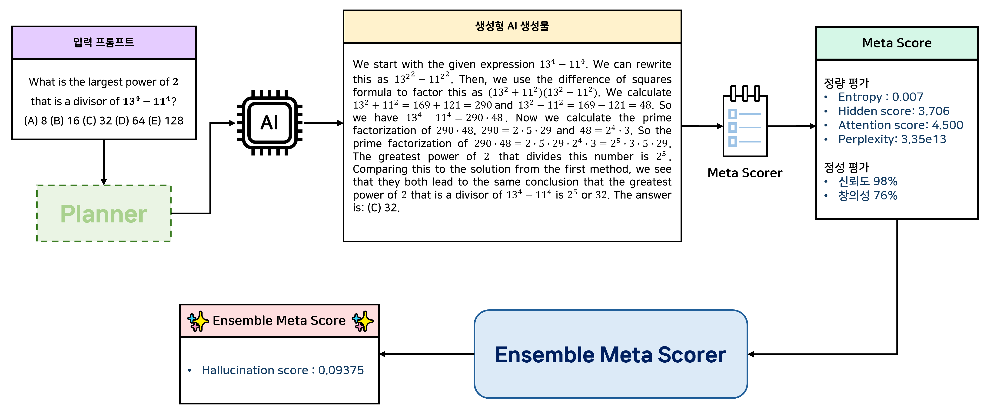

# AGI 발현을 위한 메타인지 프레임워크 핵심기술 개발 및 실증
## AGI 발현을 위한 Verifier에 대한 연구 개발
### Meta Score의 불확실한 일부 지표에 의존적이지 않은 Ensemble Meta Scoring 기법
### 💡 예시


## ⚙️ Requirements
To install requirements:
```
pip install -r requirements.txt
```

## 💻 실행 방법
### Step 1. Ensemble Scoring을 위한 Ensemble Scorer 학습하기
```
python src/ensemble_scoring.py --model_name "model_name" --dataset_name "dataset_name" --mode train --n_epochs 50 --testset_ratio 0.3
```
- ```model_name``` : 답변 생성에 사용했던 모델명
- ```dataset_name``` : 답변 생성에 사용했던 데이터셋명
- ```meta_score_res_dir``` : meta-score 결과 저장 디렉토리  
- ```ensemble_scorer_dir``` : Ensemble Scorer 학습 후 모델 파라미터 저장할 디렉토리
- ```testset_ratio``` : 학습에 사용되는 train/testset split을 위해 지정할 testset 비율

### Step 2. Ensemble Scorer를 통한 Ensemble Meta-score 계산
```
python src/ensemble_scoring.py --model_name "model_name" --dataset_name "dataset_name" --mode ensemble_scoring
```
- ```model_name``` : 답변 생성에 사용했던 모델명
- ```dataset_name``` : 답변 생성에 사용했던 데이터셋명
- ```meta_score_res_dir``` : meta-score 결과 저장 디렉토리
- ```ensemble_scorer_dir``` : Ensemble Scorer 저장된 디렉토리

### Reference
[TabM: Advancing tabular deep learning with parameter-efficient ensembling](https://openreview.net/pdf?id=Sd4wYYOhmY)
```
@inproceedings{gorishniytabm,
  title={TabM: Advancing tabular deep learning with parameter-efficient ensembling},
  author={Gorishniy, Yury and Kotelnikov, Akim and Babenko, Artem},
  booktitle={The Thirteenth International Conference on Learning Representations}
}
```
